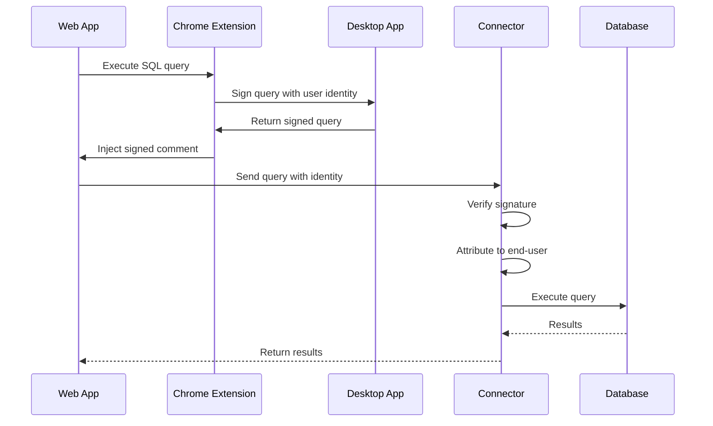

## Overview

The Formal Chrome Extension propagates your identity to web applications (like Grafana, custom dashboards, etc.) that query databases through Formal Connectors. This ensures queries are attributed to you, not a shared service account.

## Installation

Install from the [Chrome Web Store](https://chromewebstore.google.com/detail/formal-chrome-extension/kmnofogiemfbfnkgikmkaiagohndnlef):

1. Visit the extension page
2. Click **Add to Chrome**
3. Confirm permissions
4. Extension icon appears in browser toolbar

## Prerequisites

<Warning>
  The Chrome Extension requires the **Formal Desktop App** to be installed and
  running.
</Warning>

<Steps>
  <Step title="Install Desktop App">
    Download and install the [Formal Desktop
    App](/docs/guides/client-tools/desktop-app)
  </Step>
  <Step title="Log In">Run `formal auth login` to authenticate</Step>
  <Step title="Install Extension">
    Add the Chrome Extension from the Web Store
  </Step>
  <Step title="Verify">
    Both the Desktop App (system tray) and Extension (browser toolbar) should
    show as active
  </Step>
</Steps>

## How It Works



When you execute queries on supported websites:

1. **Extension detects the query** from the web application
2. **Communicates with Desktop App** via Native Messaging API
3. **Desktop App signs the query** with your ECDSA private key
4. **Signature injected** into SQL comment
5. **Connector verifies** the signature against your registered public key
6. **Query attributed** to you, not the shared service account

## Supported Websites

The extension automatically activates on:

- `*.grafana.net` - Grafana Cloud
- `*.grafana.com` - Grafana Enterprise
- Custom domains (configure in extension settings)

## Security Model

### ECDSA Key Management

1. **Key Generation**: Desktop App generates an ECDSA key pair on startup
2. **Private Key**: Stored securely in memory (never written to disk)
3. **Public Key**: Registered with Formal Connectors for verification
4. **Signing**: Extension requests Desktop App to sign queries
5. **Verification**: Connector validates signatures before execution

### Signed Binary Requirement

The Desktop App **must be a binary signed by Formal** to request ECDSA keys. This prevents malicious applications from impersonating users.

### Native Messaging API

The extension uses Chrome's Native Messaging API to communicate with the Desktop App:

- Sandboxed communication channel
- No direct network access from extension
- Desktop App acts as secure intermediary

## Configuration

### Add Custom Domains

To enable identity propagation on custom domains:

1. Click the extension icon
2. Go to **Settings**
3. Add your domain (e.g., `dashboard.example.com`)
4. Save

### Disable for Specific Sites

Temporarily disable the extension:

1. Click the extension icon
2. Toggle off for the current site
3. Refresh the page

## Use Cases

### Grafana Dashboards

When viewing Grafana dashboards that query Formal-protected databases:

- Queries are attributed to your Formal user
- Policies evaluate based on **your** permissions
- Audit logs show **your** identity, not `grafana_service_account`

### Custom Web Dashboards

For internal dashboards or BI tools:

1. Add your dashboard domain to the extension
2. Ensure your dashboard queries through a Formal Connector
3. Queries are now attributed to you

### Multi-User Applications

In shared applications where multiple users access the same data:

- Each user's queries are tracked separately
- Per-user policy enforcement
- Accurate audit trails

## Troubleshooting

<AccordionGroup>
  <Accordion title="Extension not working">
    **Possible causes:** - Desktop App not running - Not logged in via Desktop
    App - Site not in supported domains list **Solution:** 1. Check Desktop App
    is running (system tray icon visible) 2. Run `formal status` to verify login
    3. Add the site to extension settings 4. Refresh the web page
  </Accordion>

  <Accordion title="Queries still attributed to service account">
    **Possible causes:** - Connector not configured to verify signatures -
    Desktop App public key not registered - Extension not signing queries
    **Solution:** 1. Check extension icon shows "Active" 2. Verify Desktop App
    is running 3. Check [Logs](https://app.joinformal.com/logs) to see if
    signature is present 4. Contact Formal support if issue persists
  </Accordion>

  <Accordion title="Desktop App connection error">
    **Error:** ``` Cannot connect to Formal Desktop App ``` **Solution:** 1.
    Ensure Desktop App is installed and running 2. Restart the Desktop App 3.
    Reinstall the Chrome Extension 4. Check browser permissions allow Native
    Messaging
  </Accordion>
</AccordionGroup>

## Privacy

The extension:

- ✅ Only activates on configured domains
- ✅ Does not collect or store personal data
- ✅ Does not transmit data to third parties
- ✅ Only communicates with the local Desktop App
- ✅ Source code available for audit

## Best Practices

<AccordionGroup>
  <Accordion title="Keep Desktop App Running" icon="circle-check">
    The extension requires the Desktop App to be running. Enable "Launch at
    startup" in Desktop App preferences.
  </Accordion>

  <Accordion title="Verify Attribution" icon="magnifying-glass">
    Periodically check [Logs](https://app.joinformal.com/logs) to confirm
    queries are attributed to your user, not the service account.
  </Accordion>

  <Accordion title="Limit Extension Scope" icon="shield">
    Only enable the extension on trusted domains where you need identity
    propagation.
  </Accordion>
</AccordionGroup>

## Next Steps

<CardGroup cols={2}>
  <Card
    title="Desktop App"
    icon="desktop"
    href="/docs/guides/client-tools/desktop-app"
  >
    Install and configure the Desktop App
  </Card>
  <Card
    title="BI Integration"
    icon="chart-line"
    href="/docs/guides/integrations/business-intelligence"
  >
    Configure BI tools for identity propagation
  </Card>
  <Card
    title="View Logs"
    icon="file-lines"
    href="/docs/guides/observability/logs"
  >
    Verify end-user attribution in logs
  </Card>
  <Card title="Permissions" icon="key" href="/docs/guides/policies/permissions">
    Understand end-user access control
  </Card>
</CardGroup>
