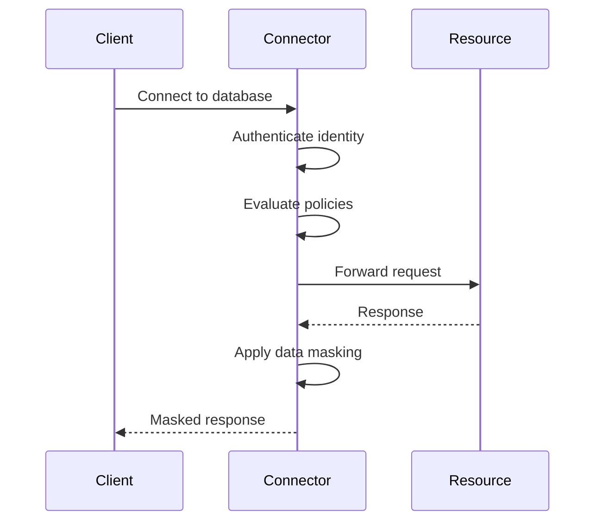

## What is a Connector?

The Formal Connector is a protocol-aware reverse proxy that sits between your users and your protected resources. It provides real-time visibility, policy enforcement, and access control over all data flowing through your infrastructure.

The Connector is designed to be extremely easy to deploy and manage, thanks to two key features:

- **Smart Routing**: The Connector listens on a single port, automatically detects the wire protocol used by the client (PostgreSQL, MongoDB, HTTP, SSH, etc.), and parses this protocol in real-time
- **Zero Config**: The Connector automatically discovers resources in your cloud environment (Kubernetes clusters, RDS instances, EC2 instances, etc.) and connects to them without manual configuration

## How Connectors Work

All client connections flow through the Connector:



The Connector intercepts every request and response, allowing you to:
- ✅ Authenticate users and verify their identity
- ✅ Evaluate access policies in real-time
- ✅ Log all queries, commands, and API calls
- ✅ Mask and redact sensitive data automatically
- ✅ Terminate suspicious sessions immediately

## Listeners and Rules

When you create a Connector, you define **listeners** that specify how clients connect to it.

### Listeners

A listener monitors a specific port for incoming client connections. You can define multiple listeners on different ports for different use cases.

<Note>
Port 8080 is reserved for the Connector's health check endpoint and cannot be used for listeners.
</Note>

### Listener Rules

Each listener uses routing rules to determine where to forward requests. There are three types of rules:

<AccordionGroup>
  <Accordion title="Resource Rule" icon="database">
    Routes all connections to a **specific resource**.
    
    Example: All traffic on port 5432 goes to the `production-postgres` database.
  </Accordion>

  <Accordion title="Technology Rule" icon="layer-group">
    Routes connections to **all resources of a specific technology** (e.g., all PostgreSQL databases).
    
    When multiple resources match, [smart routing](/docs/guides/integrations/data-technologies#smart-routing) automatically selects the correct resource based on the connection string.
    
    <Warning>
    Only supported for PostgreSQL and HTTP. Use Spaces to limit which resources are accessible.
    </Warning>
  </Accordion>

  <Accordion title="Any Rule" icon="asterisk">
    Routes to **any resource** using deep packet inspection to detect the protocol automatically.
    
    Supported protocols: PostgreSQL, MongoDB, HTTP, S3, SSH, Kubernetes.
    
    This is the most flexible option but requires the Connector to inspect traffic to determine routing.
  </Accordion>
</AccordionGroup>

<Tip>
A single listener can have multiple rules, and you can combine different rule types.
</Tip>

## Deployment

The Connector is packaged as a stateless Docker container with a distroless image and statically linked binary. It runs in your infrastructure and requires:

- **Network access** to `api.joinformal.com` (Formal Control Plane)
- **Outbound access** to your protected resources
- **Inbound access** from clients on configured listener ports

### Recommended Deployment Options

<CardGroup cols={2}>
  <Card title="AWS ECS Fargate" icon="aws">
    Deploy as a Fargate service behind a Network Load Balancer with multi-AZ availability
  </Card>
  <Card title="Kubernetes" icon="dharmachakra">
    Deploy using Helm charts on any K8s cluster (EKS, GKE, AKS, on-prem)
  </Card>
  <Card title="GCP Cloud Run" icon="google">
    Deploy as a Cloud Run service with internal load balancing
  </Card>
  <Card title="Docker" icon="docker">
    Run as a standalone container (development/testing only)
  </Card>
</CardGroup>

See the [Quickstart guide](/docs/guides/getting-started/quickstart) for step-by-step deployment instructions.

## Environment Variables

The Connector is configured primarily through the Control Plane, but requires these environment variables:

| Variable | Type | Description |
|----------|------|-------------|
| `FORMAL_CONTROL_PLANE_API_KEY` | **String** | API token to authenticate with the Control Plane (obtained when creating the Connector) |
| `LOG_LEVEL` | **Enum** | Logging verbosity: `debug`, `info`, `warn`, `error`, `fatal`, `panic`, `disabled` (default: `info`) |

<Warning>
You must restart the Connector whenever you change environment variables.
</Warning>

## Monitoring and Health

The Connector exposes a health check endpoint on port 8080:

```bash
curl http://connector-host:8080/health
```

For production monitoring, configure:
- **CloudWatch Logs** (AWS ECS)
- **kubectl logs** (Kubernetes)
- **Cloud Logging** (GCP)

See [Observability](/docs/guides/observability/logs) for detailed monitoring guidance.

## Configuration

<Tabs>
  <Tab title="Web Console">
    1. Navigate to [Connectors](https://app.joinformal.com/connectors)
    2. Click **New Connector**
    3. Enter a name
    4. Add listeners with routing rules
    5. Save and copy the API token
    6. Deploy the container with the token
  </Tab>
  <Tab title="Terraform">
    ```hcl
    resource "formal_connector" "production" {
      name = "production-connector"
      
      listener {
        port = 5432
        
        rule {
          type        = "resource"
          resource_id = formal_resource.postgres.id
        }
      }
      
      listener {
        port = 22
        
        rule {
          type = "any"
        }
      }
    }
    
    output "connector_token" {
      value     = formal_connector.production.api_key
      sensitive = true
    }
    ```
  </Tab>
</Tabs>

## Next Steps

<CardGroup cols={2}>
  <Card title="Add Resources" icon="database" href="/docs/guides/core-concepts/resources">
    Define the databases, APIs, and infrastructure the Connector protects
  </Card>
  <Card title="Configure Spaces" icon="layer-group" href="/docs/guides/core-concepts/spaces">
    Segment access with logical groupings
  </Card>
  <Card title="Write Policies" icon="shield-check" href="/docs/guides/policies/policies">
    Control who can access what with policy-as-code
  </Card>
  <Card title="Monitor Sessions" icon="radar" href="/docs/guides/observability/sessions">
    View active connections and session recordings
  </Card>
</CardGroup>

