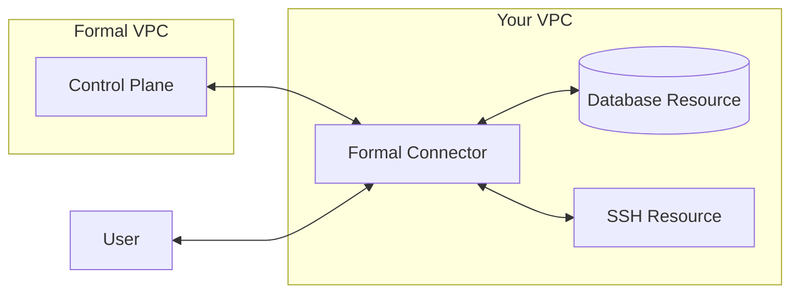
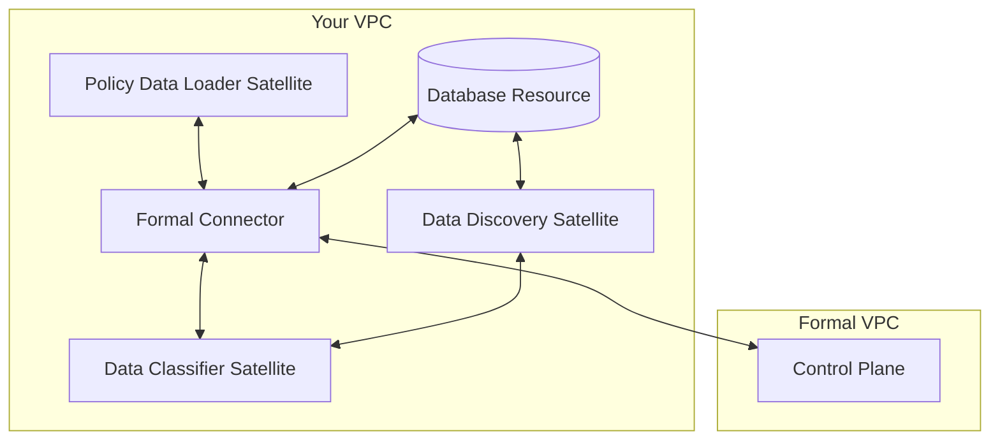

## Overview

At the heart of Formal is [the Formal Connector](/docs/guides/core-concepts/connectors), an easily deployed, cloud-native reverse proxy. Organizations can use the Formal Connector to understand and control their data. The Connector is deployed as a container in your infrastructure.

Formal's architecture relies on two main parts: a control plane and a data plane (Connector). The Control Plane cannot interact with the Customer's data, only the Connector can.

## Minimal Architecture Diagram

At a minimum, Formal consists of a Connector deployed in your own infrastructure:

The Connector needs to have network access to https://api.joinformal.com (the Control Plane), which is hosted in Formal's infrastructure. This enables you to manage your Connectors via the REST API, Terraform provider, and https://app.joinformal.com.

## Satellites

Formal has [three Satellite types](/docs/guides/core-concepts/satellites): Data Classifiers, Policy Data Loaders, and Data Discovery satellites. These satellites also are deployed in your infrastructure.
You may add these satellites if you want to leverage additional functionality in your Connector.
You can deploy any mixture of these three satellites: each satellite should be able to operate without the others.
The data discovery satellite, however, can use the data classifier satellite to be able to perform labelling.

Do note that the satellites require network access to the control plane directly as well.

## Within the Connector

The Formal Connector will interpret network traffic, identify the user, evaluate policies against requests and responses, and potentially call the policy data loader and data classifier satellites to make policy decisions. The Connector also logs and records sessions that are viewable via the Control Plane.

