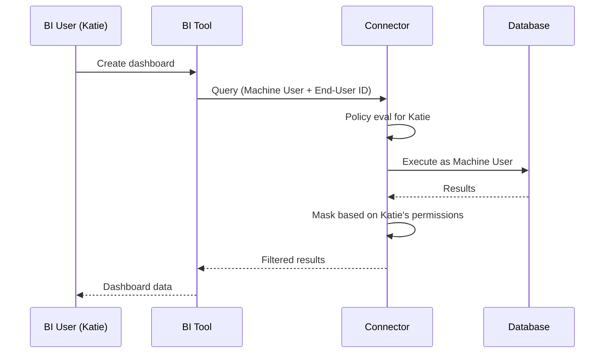

## Overview

Formal integrates with Business Intelligence applications to enable end-user identity propagation. This ensures that queries from BI tools are attributed to the actual end-user rather than a shared machine user, enabling accurate auditing and per-user policy enforcement.

## How It Works

When you set up a BI integration:

1. **Sync**: Formal Control Plane synchronizes with your BI application to fetch user identities
2. **Map**: External IDs are automatically assigned to your Formal users
3. **Propagate**: When BI tool users execute queries, their identity is passed to the Connector
4. **Enforce**: Policies evaluate based on the end-user, not the BI tool's machine user



<Note>
  The Connector automatically fetches user information from the Control Plane,
  so no additional configuration is needed in your Connector deployment.
</Note>

## Supported BI Applications


- **Metabase**
- **Looker**
- **Tableau**
- **Power BI**
- **Custom applications** (via SQL commenter)

## Setup

### Metabase

<Steps>
  <Step title="Navigate to BI Integrations">
    Go to [BI Applications](https://app.joinformal.com/bi-integrations) in the
    Formal console
  </Step>
  <Step title="Add Integration">Click **Add New App**</Step>
  <Step title="Select Metabase">Choose Metabase from the list</Step>
  <Step title="Enter Credentials">
    - **Server Hostname**: Your Metabase instance URL - **Admin Username**:
    Metabase admin username - **Admin Password**: Metabase admin password
  </Step>
  <Step title="Allow-list IPs">
    If your Metabase instance has IP restrictions, allow-list these IPs: -
    52.18.34.8 - 52.51.88.92 - 54.72.150.112
  </Step>
</Steps>

<Note>
  When connecting Metabase, the admin user will receive a "We've Noticed a New
  Metabase Login" email alert from a location in Ireland (where Formal's workers
  run).
</Note>

#### Terraform

```hcl
resource "formal_integration_bi" "metabase" {
  name = "production-metabase"

  metabase {
    hostname = "metabase.example.com"
    username = "admin@example.com"
    password = var.metabase_admin_password
  }
}
```

### Looker

Looker supports end-user identity propagation via JDBC connection parameters.

<Steps>
  <Step title="Open Database Connection">
    Go to **Admin → Connections** in Looker
  </Step>
  <Step title="Edit Connection">
    Select your database connection
  </Step>
  <Step title="Add Parameter">
    In the "Additional Params" section, add:
    
    ```
    options=formal_enduser={{ _user_attributes['email'] }}
    ```
  </Step>
  <Step title="Save">
    Save the connection settings
  </Step>
</Steps>

This configuration tells Looker to pass the end-user's email in the connection string, which Formal extracts and uses for policy evaluation.

### Custom Applications

For internal applications or custom BI tools, use the **formal-sqlcommenter** library to propagate end-user identity.

#### Python/Django

Install the package:

```bash
pip install formal-sqlcommenter
```

Use in your application:

```python
from formal_sqlcommenter import add_sql_comment
import psycopg2

# Connect as machine user
conn = psycopg2.connect(
    host="connector.joinformal.com",
    port=5432,
    user="idp:formal:machine:my_app",
    password="machine_user_token",
    database="production_db"
)

# Add end-user ID to queries
cursor = conn.cursor()
query = "SELECT * FROM users WHERE id = %s"

# This query will be attributed to the human user
commented_query = add_sql_comment(
    query,
    external_user_id="katie@example.com"  # End-user's Formal external ID
)

cursor.execute(commented_query, (123,))
```

## Configuring External IDs

External IDs map end-users in external systems to Formal users.

<Steps>
  <Step title="Create Formal User">
    Ensure a Formal user exists for the BI tool user
  </Step>
  <Step title="Add External ID">
    In the Formal user details page, add the user's ID from the BI tool For
    example, if Katie's Looker user ID is `12345`, add `12345` as an external ID
    to Katie's Formal user
  </Step>
  <Step title="Verify">
    Check [Logs](https://app.joinformal.com/logs) to confirm queries are
    attributed to the correct end-user
  </Step>
</Steps>

### Automatic Sync

For Metabase and other integrated BI tools, Formal automatically:

1. Fetches user lists from the BI application
2. Matches them to Formal users by email
3. Assigns external IDs

No manual configuration needed!

## Policy Examples

### End-User Access Control

```rego
package formal.v2

import future.keywords.if
import future.keywords.in

# Block if end-user (not machine user) lacks access
session := {
  "action": "block",
  "type": "block_with_formal_message",
  "message": "You do not have permission to access this resource",
  "reason": "End-user not in approved group"
} if {
  # Connection is from BI tool (machine user)
  input.user.type == "machine"

  # End-user is not in analyst group
  not "analyst" in input.end_user.groups
}
```

### Per-User Data Masking

```rego
package formal.v2

import future.keywords.if
import future.keywords.in

# Mask PII unless end-user has special access
post_request := {
  "action": "mask",
  "type": "nullify",
  "columns": pii_columns
} if {
  # Identify PII columns
  pii_columns := [col |
    col := input.row[_]
    col["data_label"] in ["email", "ssn", "phone"]
  ]

  count(pii_columns) > 0

  # End-user doesn't have PII access
  not "pii_access" in input.end_user.groups
}
```

### Audit BI Tool Access

```rego
package formal.v2

import future.keywords.if

# Log all BI tool queries with end-user context
pre_request := {
  "action": "allow",
  "reason": "BI tool query logged",
  "contextual_data": sprintf(
    "BI User: %s, Tool: %s, Query: %s",
    [input.end_user.email, input.user.username, input.query.query]
  )
} if {
  input.user.type == "machine"
  startswith(input.user.username, "idp:formal:machine:")
}
```

## Monitoring

### View End-User Attribution

1. Navigate to [Logs](https://app.joinformal.com/logs)
2. Filter by machine user (BI tool)
3. Check "End User" column to see attributed end-users
4. Verify queries are attributed correctly

### Session Details

In [Sessions](https://app.joinformal.com/sessions), you'll see:

- **User**: Machine user (BI tool)
- **End-User**: Actual human user in the BI tool
- **Queries**: Full query history with end-user attribution

## Troubleshooting

<AccordionGroup>
  <Accordion title="Queries not attributed to end-users">
    **Possible causes:** - BI integration not set up - External IDs not mapped -
    BI tool not passing end-user information **Solution:** 1. Verify BI
    integration is active in Formal console 2. Check Formal user has external ID
    matching BI tool user ID 3. For Looker, verify JDBC parameters are
    configured 4. Review Connector logs for end-user extraction errors
  </Accordion>

  <Accordion title="Metabase sync not working">
    **Possible causes:** - Incorrect admin credentials - IP allow-list blocking
    Formal workers - Metabase instance not reachable **Solution:** 1. Verify
    admin credentials are correct 2. Allow-list Formal worker IPs (see above) 3.
    Check Metabase logs for authentication attempts 4. Ensure Metabase instance
    is publicly accessible or VPN-accessible by Formal
  </Accordion>

  <Accordion title="Policies not evaluating for end-users">
    **Possible causes:** - Policy references `input.user` instead of
    `input.end_user` - End-user not in expected groups **Solution:** 1. Update
    policies to use `input.end_user` for BI tool queries 2. Verify end-user's
    group memberships in Formal console 3. Test policy in dry-run mode and
    review logs
  </Accordion>
</AccordionGroup>

## Best Practices

<AccordionGroup>
  <Accordion title="Always Use End-User Policies" icon="user">
    For BI tools, write policies that evaluate `input.end_user` attributes, not
    `input.user` (which is the machine user).
  </Accordion>

  <Accordion title="Implement Row-Level Security" icon="filter">
    Use end-user attributes to filter results, ensuring each BI user only sees
    data they're authorized to access.
  </Accordion>

  <Accordion title="Audit BI Access" icon="clipboard-list">
    Regularly review logs to ensure end-user attribution is working and no
    queries are misattributed.
  </Accordion>

  <Accordion title="Sync Regularly" icon="arrows-rotate">
    For integrated BI tools, Formal syncs user lists automatically. For custom
    apps, update external IDs when users are added/removed.
  </Accordion>
</AccordionGroup>

## Next Steps

<CardGroup cols={2}>
  <Card
    title="Configure External IDs"
    icon="link"
    href="/docs/guides/core-concepts/identities#external-ids-and-identity-propagation"
  >
    Map BI users to Formal users
  </Card>
  <Card
    title="Write Policies"
    icon="shield-check"
    href="/docs/guides/policies/policies"
  >
    Create end-user-based policies
  </Card>
  <Card
    title="View Logs"
    icon="file-lines"
    href="/docs/guides/observability/logs"
  >
    Monitor end-user queries
  </Card>
  <Card title="Permissions" icon="key" href="/docs/guides/policies/permissions">
    Understand end-user access control
  </Card>
</CardGroup>
