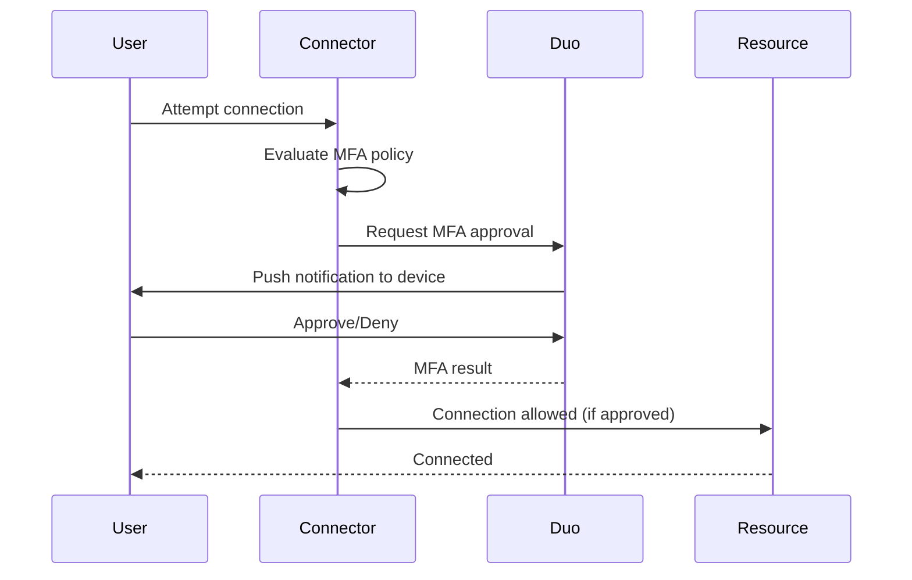

## Overview

Formal integrates with Duo Security to enforce multi-factor authentication when users attempt to connect to Formal Connectors. This adds an additional layer of security for sensitive resource access.

## How It Works

When MFA is enforced via policy, users connecting through a Formal Connector are prompted to approve the authentication request in Duo before their connection is established.



## Setup

### Prerequisites

- Active Duo Security account
- Duo application credentials (Integration Key, Secret Key, API Hostname)

### Step 1: Configure Connector Environment Variables

Add the following environment variables to your Connector deployment:

<Tabs>
  <Tab title="ECS">
    In your ECS task definition:
    
    ```json
    {
      "environment": [
        {
          "name": "DUO_IKEY",
          "value": "your-integration-key"
        },
        {
          "name": "DUO_SKEY",
          "value": "your-secret-key"
        },
        {
          "name": "DUO_HOST",
          "value": "api-xxxxx.duosecurity.com"
        }
      ]
    }
    ```
    
    Or use AWS Secrets Manager:
    
    ```json
    {
      "secrets": [
        {
          "name": "DUO_IKEY",
          "valueFrom": "arn:aws:secretsmanager:region:account:secret:duo-ikey"
        },
        {
          "name": "DUO_SKEY",
          "valueFrom": "arn:aws:secretsmanager:region:account:secret:duo-skey"
        },
        {
          "name": "DUO_HOST",
          "valueFrom": "arn:aws:secretsmanager:region:account:secret:duo-host"
        }
      ]
    }
    ```
  </Tab>
  
  <Tab title="Kubernetes">
    Create a secret:
    
    ```yaml
    apiVersion: v1
    kind: Secret
    metadata:
      name: formal-duo
      namespace: formal
    type: Opaque
    stringData:
      DUO_IKEY: your-integration-key
      DUO_SKEY: your-secret-key
      DUO_HOST: api-xxxxx.duosecurity.com
    ```
    
    Reference in deployment:
    
    ```yaml
    apiVersion: apps/v1
    kind: Deployment
    metadata:
      name: formal-connector
    spec:
      template:
        spec:
          containers:
          - name: connector
            envFrom:
            - secretRef:
                name: formal-duo
    ```
  </Tab>
  
  <Tab title="Docker">
    ```bash
    docker run -d \
      -e DUO_IKEY=your-integration-key \
      -e DUO_SKEY=your-secret-key \
      -e DUO_HOST=api-xxxxx.duosecurity.com \
      formal-connector:latest
    ```
  </Tab>
</Tabs>

<Warning>
  Replace `DUO_IKEY` (integration key), `DUO_SKEY` (secret key), and `DUO_HOST`
  (API hostname) with your actual Duo credentials.
</Warning>

### Step 2: Restart the Connector

After adding the environment variables, restart the Connector for the changes to take effect.

## Enforce MFA with Policies

### Require MFA for All Connections

```rego
package formal.v2

import future.keywords.if

session := {
  "action": "mfa",
  "reason": "MFA required for all connections"
} if {
  true
}
```

### Require MFA for Production Only

```rego
package formal.v2

import future.keywords.if

session := {
  "action": "mfa",
  "reason": "Production access requires MFA"
} if {
  input.resource.environment == "production"
}
```

### Require MFA for Specific Users

```rego
package formal.v2

import future.keywords.if
import future.keywords.in

session := {
  "action": "mfa",
  "reason": "Contractors must use MFA"
} if {
  "contractor" in input.user.groups
}
```

### Require MFA for Sensitive Resources

```rego
package formal.v2

import future.keywords.if

session := {
  "action": "mfa",
  "reason": "PII database access requires MFA"
} if {
  input.resource.name in [
    "users-pii-db",
    "customers-sensitive-db",
    "financial-data-warehouse"
  ]
}
```

### Require MFA for SSH Access

```rego
package formal.v2

import future.keywords.if

session := {
  "action": "mfa",
  "reason": "SSH access requires MFA"
} if {
  input.resource.technology == "ssh"
}
```

### Require MFA for Off-Hours Access

```rego
package formal.v2

import future.keywords.if

session := {
  "action": "mfa",
  "reason": "Off-hours access requires MFA"
} if {
  hour := time.clock([time.now_ns()])[0]

  # Require MFA between 10 PM and 6 AM UTC
  hour >= 22 or hour < 6
}
```

### Conditional MFA Based on Risk

```rego
package formal.v2

import future.keywords.if

# Require MFA if user is accessing from unknown location
session := {
  "action": "mfa",
  "reason": "MFA required for unusual access pattern"
} if {
  # Check if IP is in known ranges (requires Policy Data Loader)
  ip_country := data.ip_geolocation[input.client_ip_address].country

  allowed_countries := {"US", "CA"}
  not ip_country in allowed_countries
}
```

## User Experience

When MFA is enforced, users see:

1. **Connection Attempt**: User initiates connection through Connector
2. **MFA Prompt**: "Waiting for MFA approval..."
3. **Duo Push**: User receives push notification on their Duo-enrolled device
4. **Approval**: User approves or denies the request
5. **Connection**: If approved, connection proceeds; if denied, connection is blocked


## Duo Enrollment

Users must enroll in Duo before MFA policies can be enforced. Enrollment typically involves:

1. Downloading the Duo Mobile app
2. Scanning a QR code provided by your Duo administrator
3. Verifying their device

<Tip>
  Work with your IT or security team to ensure all users who need access through
  Formal are enrolled in Duo.
</Tip>

## Troubleshooting

<AccordionGroup>
  <Accordion title="MFA prompts not appearing">
    **Possible causes:** - Duo environment variables not set correctly in
    Connector - Connector not restarted after adding variables - User not
    enrolled in Duo **Solution:** 1. Verify `DUO_IKEY`, `DUO_SKEY`, and
    `DUO_HOST` are set 2. Restart the Connector 3. Check Connector logs for Duo
    integration errors 4. Verify user is enrolled in Duo
  </Accordion>

<Accordion title="Connection times out waiting for MFA">
  **Possible causes:** - User didn't approve the request in time - User denied
  the request - Network connectivity issues between Connector and Duo
  **Solution:** 1. Check user's Duo app for pending requests 2. Verify Connector
  can reach `*.duosecurity.com` 3. Review Connector logs for timeout errors
</Accordion>

  <Accordion title="MFA bypassed unexpectedly">
    **Possible causes:** - Policy not active or in dry-run mode - Policy
    conditions not matching the connection - MFA action not returned by policy
    **Solution:** 1. Verify policy status is "Active" 2. Check policy logs to
    see if it evaluated for the connection 3. Test policy in dry-run mode and
    review logs
  </Accordion>
</AccordionGroup>

## Best Practices

<AccordionGroup>
  <Accordion title="Production Access" icon="shield">
    Always require MFA for production resource access. This is critical for
    compliance and security.
  </Accordion>

<Accordion title="Privileged Operations" icon="user-lock">
  Require MFA for SSH, Kubernetes exec, and database write operations, even in
  non-production environments.
</Accordion>

<Accordion title="Risk-Based MFA" icon="chart-line">
  Use dynamic policies to require MFA based on risk factors like IP location,
  time of day, or resource sensitivity.
</Accordion>

<Accordion title="Secure Credentials" icon="lock">
  Store Duo credentials in a secret manager (AWS Secrets Manager, Kubernetes
  Secrets) rather than plain environment variables.
</Accordion>

  <Accordion title="Monitor MFA Denials" icon="bell">
    Set up alerts for MFA denials, which may indicate unauthorized access
    attempts.
  </Accordion>
</AccordionGroup>

## Compliance

MFA enforcement helps meet compliance requirements for:

- **SOC 2**: Demonstrates access controls and authentication mechanisms
- **HIPAA**: Protects ePHI with multi-factor authentication
- **PCI DSS**: Requirement 8.3 - MFA for access to systems with cardholder data
- **GDPR**: Technical measures to ensure security of personal data

## Next Steps

<CardGroup cols={2}>
  <Card
    title="Write Policies"
    icon="shield-check"
    href="/docs/guides/policies/policies"
  >
    Create MFA enforcement policies
  </Card>
  <Card
    title="Monitor Sessions"
    icon="radar"
    href="/docs/guides/observability/sessions"
  >
    View MFA-protected sessions
  </Card>
  <Card
    title="Configure Connectors"
    icon="server"
    href="/docs/guides/core-concepts/connectors"
  >
    Set up Connector environment variables
  </Card>
  <Card
    title="Threat Scenarios"
    icon="triangle-exclamation"
    href="/docs/guides/policies/threat-scenarios"
  >
    Combine MFA with threat detection
  </Card>
</CardGroup>
