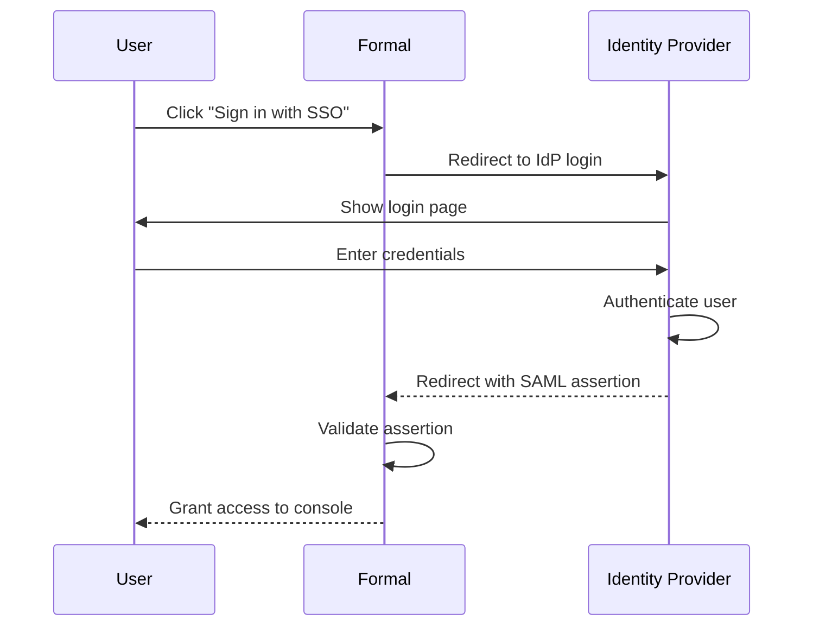

## Overview

Formal supports Single Sign-On (SSO) integration with major identity providers, enabling your team to access the Formal console using their existing corporate credentials. This streamlines user management and improves security by centralizing authentication.

## Supported Providers

- **Okta**
- **Azure AD / Microsoft Entra ID**
- **Google Workspace**
- **Auth0**
- **OneLogin**
- **JumpCloud**
- **Any SAML 2.0 or OIDC provider**

<Note>
  Formal uses [WorkOS](https://workos.com/) to provide enterprise-grade SSO
  integration with a simple setup process.
</Note>

## How It Works

1. **User** clicks "Sign in with SSO" on Formal login page
2. **Formal** redirects to your identity provider
3. **Identity Provider** authenticates the user
4. **User** is redirected back to Formal with authentication token
5. **Formal** creates or updates the user's account and grants access

## Setup

<Steps>
  <Step title="Navigate to SSO">
    Go to [SSO](https://app.joinformal.com/sso) in the Formal console
  </Step>
  <Step title="Add Connection">Click **Add new SSO connection**</Step>
  <Step title="Select Provider">
    Choose your identity provider from the list
  </Step>
  <Step title="Configure Integration">
    Follow the step-by-step instructions provided by WorkOS: - For **SAML**:
    Configure SSO URL, Entity ID, and X.509 certificate - For **OIDC**:
    Configure Client ID, Client Secret, and authorization endpoints WorkOS
    provides detailed, provider-specific setup guides.
  </Step>
  <Step title="Configure Domain">
    After integration is successful, specify which email domains are allowed for
    this SSO connection Example: Add `@example.com` to allow all `*@example.com`
    users to sign in via SSO
  </Step>
</Steps>

## Self Sign-Up

Enable self sign-up to allow users to create their own Formal accounts when signing in with SSO for the first time.

<Steps>
  <Step title="During Setup">
    When configuring your SSO provider, toggle **Allow self sign-up**
  </Step>
  <Step title="Save">
    Users from allowed domains can now sign up automatically
  </Step>
</Steps>

### With Self Sign-Up Enabled

- Users from allowed domains sign in with SSO
- Formal automatically creates a user account on first login
- Users have **viewer** permissions by default
- Admins can upgrade permissions as needed

### With Self Sign-Up Disabled

- Admins must manually invite users to Formal
- Users receive an email invitation
- Users can then sign in with SSO

<Tip>
  Enable self sign-up for faster onboarding in organizations where all employees
  should have access to Formal. Disable it if you want to manually approve each
  user.
</Tip>

## Domain Configuration

You can specify multiple domains for a single SSO connection.

**Example:**

- Primary domain: `@acme.com`
- Subsidiary domain: `@acme-labs.com`

Both domains will use the same SSO provider and configuration.

## Multiple SSO Providers

Organizations with multiple identity providers (e.g., different subsidiaries or acquisition integrations) can configure multiple SSO connections:

1. Set up the first SSO connection for Domain A
2. Add a second SSO connection for Domain B
3. Users authenticate based on their email domain

Formal automatically routes users to the correct identity provider based on their email address.

## User Provisioning

### Manual Provisioning

<Steps>
  <Step title="Navigate to Users">
    Go to [Users](https://app.joinformal.com/users)
  </Step>
  <Step title="Invite User">Click **New User** and enter the user's email</Step>
  <Step title="User Signs In">
    User receives invitation email and clicks the link
  </Step>
  <Step title="SSO Authentication">
    User is redirected to your SSO provider
  </Step>
  <Step title="Access Granted">
    After authentication, user gains access to Formal
  </Step>
</Steps>

### Automatic Provisioning (with Self Sign-Up)

Users from allowed domains can sign in directly:

1. User visits `https://app.joinformal.com`
2. Clicks "Sign in with SSO"
3. Enters email address
4. Authenticates with your SSO provider
5. Formal creates account automatically
6. User gains access

## Directory Sync

For advanced user management, integrate [Directory Sync](/docs/guides/configuration/console#directory-sync) to automatically sync users and groups from your identity provider to Formal.

Benefits:

- Automatic user provisioning and deprovisioning
- Group membership sync
- User attribute sync (name, email, role)
- Reduced manual administration

## Troubleshooting

<AccordionGroup>
  <Accordion title="SSO login fails">
    **Possible causes:** - Incorrect SSO configuration - Domain not added to
    allowed list - Certificate or secret expired **Solution:** 1. Verify SSO
    configuration in Formal console 2. Check that user's email domain is in the
    allowed domains list 3. Verify SAML certificate or OIDC credentials are
    current 4. Review WorkOS setup guide for your provider
  </Accordion>

{" "}

<Accordion title="User not auto-created with self sign-up">
  **Possible causes:** - Self sign-up not enabled - User's domain not in allowed
  list - SSO provider not returning email attribute **Solution:** 1. Verify self
  sign-up toggle is enabled 2. Check domain is in allowed domains list 3. Ensure
  SSO provider sends email in SAML assertion/OIDC token
</Accordion>

  <Accordion title="Wrong SSO provider redirected">
    **Possible causes:** - Multiple SSO connections with overlapping domains -
    Domain configured in wrong SSO connection **Solution:** 1. Review SSO
    connections and domains 2. Ensure each domain is only configured once 3.
    Remove domain from incorrect SSO connection
  </Accordion>
</AccordionGroup>

## Security Best Practices

<AccordionGroup>
  <Accordion title="Enforce SSO" icon="lock">
    Disable password-based authentication for users with SSO-enabled domains to
    ensure all access goes through your identity provider.
  </Accordion>

{" "}

<Accordion title="Use MFA" icon="shield-keyhole">
  Enable MFA in your identity provider for an additional layer of security when
  accessing Formal.
</Accordion>

{" "}

<Accordion title="Limit Self Sign-Up" icon="user-plus">
  Only enable self sign-up if all employees should have Formal access.
  Otherwise, manually provision users for better control.
</Accordion>

{" "}

<Accordion title="Regular Audits" icon="clipboard-list">
  Periodically review SSO connections and domain configurations to ensure they
  match your current organizational structure.
</Accordion>

  <Accordion title="Monitor Sign-Ins" icon="chart-line">
    Review SSO sign-in logs in your identity provider to detect unusual
    authentication patterns.
  </Accordion>
</AccordionGroup>

## Compliance

SSO integration supports compliance requirements for:

- **SOC 2**: Centralized authentication and access control
- **HIPAA**: Secure authentication for systems accessing ePHI
- **ISO 27001**: Identity and access management controls
- **GDPR**: User authentication and authorization tracking

## Next Steps

<CardGroup cols={2}>
  <Card
    title="Directory Sync"
    icon="arrows-rotate"
    href="/docs/guides/configuration/console#directory-sync"
  >
    Automatically sync users and groups
  </Card>
  <Card
    title="User Management"
    icon="users"
    href="/docs/guides/core-concepts/identities"
  >
    Learn about Formal users and groups
  </Card>
  <Card
    title="MFA Integration"
    icon="shield-keyhole"
    href="/docs/guides/integrations/mfa"
  >
    Add multi-factor authentication
  </Card>
  <Card
    title="Console Guide"
    icon="browser"
    href="/docs/guides/configuration/console"
  >
    Manage Formal console settings
  </Card>
</CardGroup>
